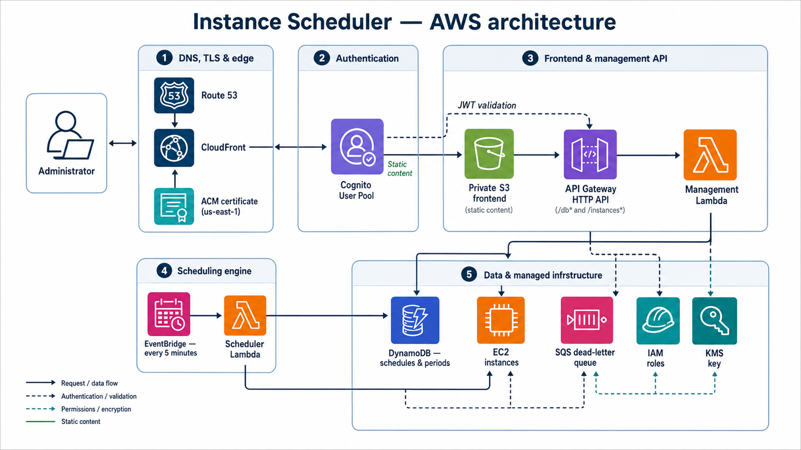

# Terraform AWS Instance Scheduler

[](https://www.technative.nl)

This Terraform module deploys an authenticated web application that starts and
stops EC2 instances according to reusable schedules.

Schedules and periods are stored in DynamoDB. An EventBridge rule invokes the
scheduler Lambda every five minutes. The frontend is served from a private S3
bucket through CloudFront and is protected by Amazon Cognito.

## Features

- Create, view, and delete unused schedules through the frontend.
- Create, edit, assign, remove, and delete periods.
- Create unassigned periods for later use.
- Assign, change, or remove schedules on EC2 instances.
- View assigned instance schedules in a weekly calendar.
- Temporarily prevent scheduled stopping with `Ignore_scheduler`.
- Authenticate users with Cognito managed login and OAuth 2.0 PKCE.
- Publish the frontend on a custom Route 53 domain with an ACM certificate.
- Use either an existing public hosted zone or a new delegated hosted zone.
- Optionally create initial schedules and periods from Terraform.

## Architecture

[](docs/architecture.md)

See the [architecture documentation](docs/architecture.md) for the request
flows and the editable [Mermaid source](docs/architecture.mmd).

The main request paths are:

1. Route 53 directs the frontend hostname to CloudFront.
2. CloudFront serves static files from a private S3 bucket.
3. Cognito authenticates users.
4. CloudFront forwards `/db*` and `/instances*` requests to API Gateway.
5. API Gateway validates the Cognito JWT and invokes the management Lambda.
6. EventBridge invokes the scheduler Lambda every five minutes.
7. Both Lambda functions use DynamoDB and EC2 APIs.

## Scheduling model

### Period

A period defines:

- One or more weekdays: `mon`, `tue`, `wed`, `thu`, `fri`, `sat`, or `sun`.
- An optional start time in 24-hour `HH:MM` format.
- A required stop time in 24-hour `HH:MM` format.
- An IANA timezone such as `Europe/Amsterdam`.

When the start time is omitted, the period is stop-only. It does not start an
instance and starts returning a stop decision after the configured stop time.

### Schedule

A schedule contains one or more periods. A schedule cannot be empty.

A schedule can only be deleted when no EC2 instance has that schedule assigned.
Deleting a schedule does not delete its periods.

Schedules declared in the Terraform `schedules` input remain Terraform-managed.
If one is deleted in the frontend, a later `terraform apply` can recreate it.

The schedule name is stored in the EC2 tag:

```text
InstanceScheduler=<schedule-name>
```

If any assigned period returns a start decision, the instance is started.
Otherwise, a stop decision can stop the instance.

### Ignore override

The frontend can add an override tag:

```text
Ignore_scheduler=22:00 Europe/Amsterdam
```

This keeps the schedule assigned but prevents the scheduler from stopping the
instance until the configured local time. The tag is removed automatically
after it expires, and normal scheduling resumes on the next evaluation.

## Prerequisites

The caller must provide:

- An AWS provider for the deployment region.
- An aliased AWS provider for `us-east-1`, required by CloudFront ACM.
- An existing KMS key ARN.
- An existing SQS queue ARN used as the Lambda dead-letter queue.
- A globally unique S3 bucket name.
- A public Route 53 hosted zone ID, or a domain name for a new hosted zone.
- Permission to create the resources used by this module.

## Usage

### Existing Route 53 hosted zone

This is the recommended configuration when the parent domain already exists in
Route 53.

```hcl
provider "aws" {
  region = "eu-central-1"
}

provider "aws" {
  alias  = "us_east_1"
  region = "us-east-1"
}

module "scheduler" {
  source = "git::ssh://git@github.com/wearetechnative/terraform-aws-module-scheduler.git?ref=<version>"

  providers = {
    aws           = aws
    aws.us_east_1 = aws.us_east_1
  }

  bucket_name          = "technative-instance-scheduler"
  dynamodb_table_name  = "instance-scheduler"
  lambda_role_name     = "instance-scheduler"
  kms_key_arn          = aws_kms_key.scheduler.arn
  sqs_arn              = aws_sqs_queue.scheduler_dlq.arn
  route53_zone_id      = "Z0123456789EXAMPLE"
  frontend_fqdn        = "scheduler.example.com"
}
```

The module creates the ACM validation record and the CloudFront `A` and `AAAA`
alias records in the supplied zone.

### New delegated hosted zone

To create a dedicated hosted zone for the frontend:

```hcl
module "scheduler" {
  # Other required inputs omitted

  route53_zone_name = "scheduler.example.com"
  frontend_fqdn     = "scheduler.example.com"
}
```

After applying, delegate `scheduler.example.com` from the parent DNS zone to
the name servers returned by:

```hcl
output "scheduler_name_servers" {
  value = module.scheduler.route53_name_servers
}
```

Do not create a second hosted zone for an existing authoritative domain unless
you intend to change its delegation.

### Initial periods and schedules

Both inputs are optional. When omitted, the application starts with an empty
configuration and periods and schedules can be created through the frontend.

```hcl
module "scheduler" {
  # Other required inputs omitted

  periods = [
    {
      name      = "office-hours"
      days      = ["mon", "tue", "wed", "thu", "fri"]
      begintime = "09:00"
      endtime   = "17:00"
      timezone  = "Europe/Amsterdam"
    },
    {
      name      = "weekend-stop"
      days      = ["sat", "sun"]
      begintime = ""
      endtime   = "20:00"
      timezone  = "Europe/Amsterdam"
    }
  ]

  schedules = [
    {
      name   = "business-hours"
      period = ["office-hours", "weekend-stop"]
    }
  ]
}
```

Every predefined schedule must contain at least one period.

## Creating frontend users

The Cognito user pool only permits administrator-created users. Email is
currently configured as the username.

```bash
aws cognito-idp admin-create-user \
  --region eu-central-1 \
  --user-pool-id <user-pool-id> \
  --username user@example.com
```

Retrieve the user pool ID with:

```hcl
output "scheduler_user_pool_id" {
  value = module.scheduler.cognito_user_pool_id
}
```

The user receives a temporary password and must set a permanent password at
first login.

## Inputs

| Name | Type | Default | Required | Description |
| --- | --- | --- | :---: | --- |
| `bucket_name` | `string` | — | yes | Globally unique private S3 bucket for frontend assets. |
| `dynamodb_table_name` | `string` | — | yes | DynamoDB table name for schedules and periods. |
| `frontend_fqdn` | `string` | — | yes | Frontend hostname without `https://`. |
| `kms_key_arn` | `string` | — | yes | Existing KMS key used by the Lambda modules and DynamoDB module. |
| `lambda_role_name` | `string` | — | yes | Name suffix used for the Lambda IAM roles. |
| `sqs_arn` | `string` | — | yes | Existing SQS dead-letter queue ARN. |
| `periods` | `list(object)` | `[]` | no | Periods created during deployment. |
| `schedules` | `list(object)` | `[]` | no | Schedules created during deployment. |
| `route53_zone_id` | `string` | `null` | conditional | Existing public hosted zone ID. |
| `route53_zone_name` | `string` | `null` | conditional | Public hosted zone to create when no zone ID is supplied. |

Set exactly one of `route53_zone_id` or `route53_zone_name`.

## Outputs

| Name | Description |
| --- | --- |
| `bucket_url` | Authenticated custom frontend URL. |
| `cloudfront_url` | Generated CloudFront distribution URL. |
| `frontend_url` | Authenticated custom frontend URL. |
| `frontend_fqdn` | Frontend hostname. |
| `frontend_certificate_arn` | ACM certificate used by CloudFront. |
| `cognito_user_pool_id` | Cognito user pool ID. |
| `cognito_user_pool_client_id` | Cognito app client ID. |
| `cognito_login_domain` | Cognito managed-login domain. |
| `route53_zone_id` | Hosted zone used by the module. |
| `route53_name_servers` | Name servers when the module creates the hosted zone; otherwise empty. |

## Deployment notes

- CloudFront deployment can take several minutes after `terraform apply`.
- HTML and authentication assets use no-cache headers, but a hard refresh can
  still be useful immediately after deployment.
- When updating a remote module installation, run `terraform init -upgrade`
  before `terraform apply`.
- The ACM certificate is created in `us-east-1`, regardless of the application
  deployment region.
- The frontend and API are exposed through the same CloudFront hostname.

## User documentation

End-user instructions are maintained separately in the
[Instance Scheduler User Manual](docs/user-manual.md).

## Development

Install the repository pre-commit hooks:

```bash
pre-commit install
```

See the [pre-commit documentation](https://pre-commit.com/#install) for setup
instructions.

## License

See [LICENSE](LICENSE).
