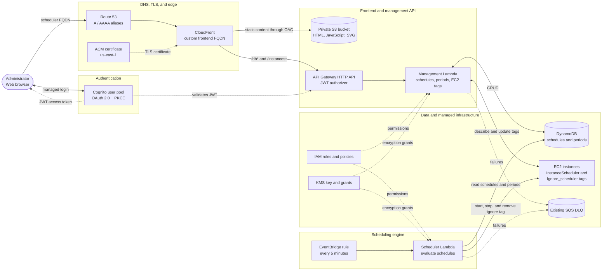

# Instance Scheduler architecture

The diagram shows the authenticated frontend path, management API, scheduling
engine, and supporting AWS services. The Mermaid diagram below is retained as
an editable text version.

## Request flows

- CloudFront serves frontend assets from the private S3 bucket through OAC.
- Cognito authenticates users with OAuth 2.0 authorization code and PKCE.
- API Gateway validates JWT access tokens before invoking the management
  Lambda.
- The management Lambda stores schedules and periods and manages EC2 tags.
- EventBridge invokes the scheduler Lambda every five minutes.
- The scheduler Lambda reads DynamoDB and starts or stops EC2 instances.
- Both Lambda functions use the supplied SQS dead-letter queue.

The standalone Mermaid source is available in
[`architecture.mmd`](architecture.mmd).
